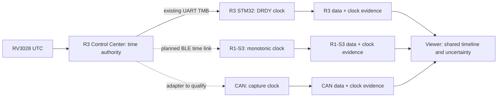

# R3 / R1-S3 / CAN time synchronization

Architecture decision, 2026-09-09. Owner requirement: R1-S3 must connect to R3
over Bluetooth and understand its time beacon. Correlate voltage/current/energy
from R1-S3, fast sensor signals from R3, and CAN events on one timeline.
[Engineering plan](R1_S3_PLAN.md) · [Owner notes](uk/ECOSYSTEM_TIME_SYNC.md).

## Implementation boundary

| Part | Status |
|---|---|
| R3 RV3028 authority and `$TMB` | Source audited; current transport is UART to STM32 |
| R1-S3 legacy decoder/tracker | Portable `r3_time_beacon.h/.cpp` foundation; host-tested; no runtime transport attached |
| R3 BLE server / R1-S3 BLE client | Required next implementation; not implemented by this change |
| Offset/drift model, synchronized file records and UI | Design below; not implemented or physically qualified |
| DS3231, sample timing, EEPROM and CSV v1 | Existing behavior unchanged |

The CAN sniffer's source/board and timestamp contract have not been audited here.
Do not assume it already supports BLE or hardware bus-arrival timestamps.

## Shared timeline

For example, compare a CAN command with current rise, supply sag and sensor
response. Keep each device's native sample rate and timestamps. Alignment does
not increase R1-S3 bandwidth, eliminate INA228 sequential-channel timing or prove
causation. A shared test/group ID associates independently started recordings;
equal filenames and START reception times cannot align their samples.



## Existing R3 protocol and limitations

Read-only audit of `lily-logger-r3`, HEAD `cdfa3b9` with local modifications.
References describe the inspected working tree, not a newly tested release.

| Source | Finding |
|---|---|
| `cc/src/main.cpp:2298` | `send_time_metronome_beacon()` writes the line below and flushes UART |
| `cc/src/main.cpp:12119` | CCTX UART1, TX15/RX16, 2,000,000 baud, 8N1 |
| `cc/src/cctx_time.cpp:519` | Software poll about once per second; sequence increments, skipping zero on wrap |
| `cc/src/cctx_time.cpp:640` | Integer RTC seconds read twice, separated by 2 ms |
| `cc/include/cctx_time.h:7` | RV3028 INT unused; no captured RTC second edge |
| `firmware/stm32/CM4/Core/Src/mbx_cm4.c:235` | CM4 also accepts historical/ambiguous alternate field orders |
| `firmware/stm32/CM7/Core/Src/sd_filelog.c:1535` | TCHK extrapolates later RTC/metro values from elapsed local time and the starting anchor |

```text
$TMB,<seq>,<unix_s>,<valid>,<last_tick_ms>\n
```

Unsigned decimal u32 fields, except `valid` exactly 0/1. Sequence runs 1 through
UINT32_MAX then 1. `last_tick_ms` is R3 ESP `millis()` captured before the RTC poll;
it wraps and is not the receiver's uptime. `valid=0` is valid packet evidence,
but not valid UTC. A sequence gap measures missing generated beacons, not seconds.

The new R1-S3 decoder accepts the exact current emitter layout, canonical decimal
and LF, maximum 40 bytes. It rejects overflow, truncation, extra fields, CR/NUL and
alternate-order guessing. The tracker preserves raw decoded/accepted observations,
u64 local receive time and explicit connection segments. It counts malformed,
duplicate, reordered and missing packets, and handles R3's zero-skipping wrap.
Freshness expires at 5 seconds; decoded invalid-time evidence revokes UTC
eligibility. Eligibility means only fresh sender-valid evidence, never clock lock.
It has no allocation, radio dependency, RTC write or UTC offset calculation.
Use a single owner; the tracker is not a stream framer or cross-core queue.

Legacy TMB lacks version, device/boot ID, clock revision, uncertainty, transmit
capture, CRC and authentication. A restart without reconnect cannot be reliably
distinguished from old packets. UART/BLE adapters must bound and frame complete
messages; never pass partial notifications as complete beacons.

The RTC validity flag does not establish accuracy against UTC. Integer-second
software polling does not prove millisecond phase accuracy. R3 DATA/DTBM preserve
the local ADC clock; existing TCHK/TCKS are not repeated precise captures of real
received beacons. A measured bridge from CC monotonic time to STM32 DRDY time is
still needed. The current implementation establishes no inter-device error bound.
R3 docs reserve BLE for future service links and propose RS-485 for precise sync.

## BLE connection contract to implement

Use **Bluetooth LE GATT**: R3 peripheral/server, R1-S3 central/client selecting
one R3. ESP32-S3 supports LE rather than Classic SPP; see the
[Espressif stack overview](https://docs.espressif.com/projects/esp-idf/en/stable/esp32s3/api-guides/ble/overview.html).
R3 should support R1-S3 and a capable CAN node together; other CAN hardware needs
a qualified gateway/wired adapter.

Publish one shared versioned service definition in both repos: stable project
UUIDs, exact lengths, byte order, capabilities and golden packets. No deployed
UUID exists today. The following is required content, not an assigned wire ABI:

- **Identity/capabilities (read):** version, stable public device ID, role, boot ID,
  time-domain ID, clock-exchange capability and transport limits.
- **Beacon (notify):** sequence, boot ID, clock revision, sender monotonic capture
  in u64 microseconds, UTC anchor/validity, source uncertainty and capture method.
  Legacy TMB can be carried only as an explicitly identified coarse record.
- **Exchange (request/reply):** request ID, local send t1, R3 receive t2 and reply
  send t3; R1 captures t4 immediately on notification entry. Match IDs/boot/revision
  and reject expired replies. Define each capture point and timestamp resolution.

Support negotiated ATT sizes with bounded framing/message IDs/lengths/timeouts;
do not assume one notification can carry a complete exchange. Detect missing
notifications by sequence. Discovery, subscription, reconnect and capped backoff
must not block recording. Reject unsupported versions and unexpected identities.
Choose the R3 explicitly in UI; use pairing/bonding and identity verification,
not just its advertised name. Keep keys outside public profiles/logs.

Peer and sync policy are explicit Save settings while stopped. Add a versioned
settings migration with default disabled; do not silently consume EEPROM reserve
or change the current config-v1 layout. No per-beacon EEPROM writes.

## Clock model and failure behavior

Keep three concepts separate: immutable local acquisition time; common R3
monotonic time; optional UTC anchor. Relative correlation can work without UTC.
Represent mappings in segments around nearby integer origins:

```text
r3_us = r3_origin_us + scale * (local_us - local_origin_us)
utc_us = utc_origin_us + (r3_us - utc_anchor_r3_us)  [valid anchor only]
```

Retain raw observations as well as fitted offset/drift and model version. Stored
stamps are integer microseconds; frontend JSON represents u64 values as decimal
strings. Never adjust sample timestamps, acquisition deadlines or integration dt.

At approximately equal rates, an initial four-stamp R3-minus-local offset is
`((t2-t1)+(t3-t4))/2`; residual RTT is `(t4-t1)-(t3-t2)`. Repeated low-delay
exchanges estimate offset/drift. Asymmetric radio/host delay remains uncertainty.
Reject negative/excessive RTT, mismatched replies and discontinuities; account for
capture resolution, queue delay and source accuracy. Never assign `unix_s*1e6`
to the receiver callback or use a nominal BLE interval as a guaranteed error bound.

| State | Meaning |
|---|---|
| Disabled / searching | Autonomous recording; no current shared-clock claim |
| Connected, unqualified | Transport alive; insufficient timing evidence; legacy TMB provides coarse association only |
| Locked | Versioned model passes explicit residual/age/error-budget gates |
| Holdover | Link lost; previous model ages with increasing uncertainty from qualified drift bounds |
| Expired / invalid | Error bound unknown or age limit exceeded; local recording continues |

Five-second legacy freshness is not a lock criterion. Without qualified drift
bounds, holdover uncertainty becomes unknown immediately. Report UTC validity
separately from relative-clock quality. Peer reboot, source/clock revision change,
time jump or ambiguous reset begins a new segment; do not join them silently.
Automatic master election is outside the initial scope.

DS3231 remains the autonomous wall clock. No RTC writes per beacon. Explicit RTC
adjustment is STOP-only via the existing I2C owner. Losing BLE neither stops a
session nor rewrites past UTC. Current CSV v1 keeps its frozen starting anchor;
dynamic clock evidence awaits the versioned extension below.

## Ownership and buffering

Core 0 owns BLE discovery/client lifecycle and clock estimation alongside UI.
Callbacks only capture local time and copy bounded data; no I2C, SD, EEPROM, JSON
or blocking operations. Core 1 retains acquisition/I2C at highest application
priority plus the separate lower-priority sole SD owner. Pass bounded messages
and snapshots; do not expose mutable clock/config state across tasks.

Preserve PSRAM sample FIFO and 8 KiB internal output staging. Plan a separate
64-entry fixed-size clock-event queue, finalized with the wire ABI; avoid per-packet
allocation. The SD owner orders/associates evidence by local capture time, not
callback scheduling. Sync overflow is counted and invalidates sync coverage;
it must not discard samples or block the producer. Persist relevant evidence before
claiming file synchronization; RAM-only status is insufficient.

BLE and Wi-Fi share the radio; core affinity does not remove contention. Qualify a
pinned Arduino-compatible BLE stack with the current AP UI and toolchain before
enabling it by default. Measure internal heap/stack, queue drops, RTT/residuals,
sample lateness and SD latency. See [Espressif RF coexistence](https://docs.espressif.com/projects/esp-idf/en/v5.1/esp32s3/api-guides/coexist.html).

## Files and viewer

Leave native schema 1 unchanged. New sync control records need an explicitly
versioned format/reader contract, not extra v1 columns or unrecognized comments.
The extension must carry:

- device/local boot ID, shared test/group ID and independent recording ID;
- authority device/boot/domain/clock revision and mapping segment;
- local/remote captures, optional UTC anchor, offset/drift, uncertainty and validity interval;
- original beacons/exchanges, capture method, model version and quality;
- loss, reconnect, step, holdover/expiry and overflow events protected by file
  integrity, with rotation linkage and interrupted-file recovery.

Each rotation part needs the current model and its qualifying evidence for
self-contained interpretation. Only the SD owner writes these records. Energy
continues using local elapsed time. Legacy export warns when sync evidence is lost.

Viewer adapters preserve R1, R1-S3 v1, R3 and CAN originals. Shared time is an overlay
with uncertainty per segment, not destructive resampling. If error intervals overlap,
event order is unresolved. Unknown historical relationships stay unknown; manual
marker alignment is a labelled user estimate. Existing v1 readers must keep passing.

## Delivery order and gates

| Stage | Deliverable | Acceptance |
|---|---|---|
| S0, this change | Audit, legacy decoder/tracker, architecture | Host malformed/wrap/stale tests and normal build; no radio claim |
| S1 | Shared BLE contract, R3 server, R1 client, peer selection/diagnostics | Real connect/reconnect, MTU/version/identity failures; no acquisition regression |
| S2 | Offset/drift/error model, CC-to-DRDY bridge, CAN clock audit | Shared physical event and independent reference establish error bounds |
| S3 | Versioned files/readers, owner queues, UI quality and saved policy | Golden/corruption/rotation/reboot tests, backward compatibility and autonomous operation |
| S4 | R1-S3 + R3 + actual CAN node | End-to-end alignment and endurance; no silent time jumps or optimistic lock |

S1 is the next synchronization step and changes both repositories. Preserve R3's
existing local work and UART behavior. Keep sync work separate from the unresolved
UART endurance fault. S0 performs no firmware flashing or physical BLE tests.

Bench matrix: R1 at 1/50/300 Hz, representative R3 high-rate recording, Wi-Fi UI
active/absent, allowed download load, multiple BLE clients, poor reception,
disconnect/reboot of each node, RTC invalid/step, long holdover and full event queue.
Compare a shared electrical event within all channel ratings using an independent
timing reference. Publish p50/p95/max residuals, uncertainty, duration and failures.
If measured BLE precision is insufficient, qualify a wired edge/SYNC-Link. Do not
promise millisecond accuracy or infer it from formatted microsecond timestamps.

## Source fingerprints

S0 validation, 2026-09-09: `python -m unittest tests.test_r3_time_beacon
tests.test_sample_clock tests.test_recording_format tests.test_contracts -v`
passed all 24 tests, including both production/reference CSV paths. The new
portable core compiles with `-Wall -Wextra -Werror`. `pio run -e esp32-s3`
passed; no upload performed. Independent review checked the decoder and sequence
arithmetic against the actual R3 emitter.

SHA-256 of the inspected R3 working-tree inputs:

```text
cc/src/main.cpp
e405c316e2f89f8f9ed36d129fd7613fa9419df32297d1dce391647d6d687a15
cc/src/cctx_time.cpp
0eeed7dc5f03ad81fcd03aedffcf94120cf71415f121794ab6f477ee80cd47ae
firmware/stm32/CM7/Core/Src/sd_filelog.c
fe513abf1c67132159c37b42de05c69d161bc1bf9c750d7c4f0a47de7486f751
```
